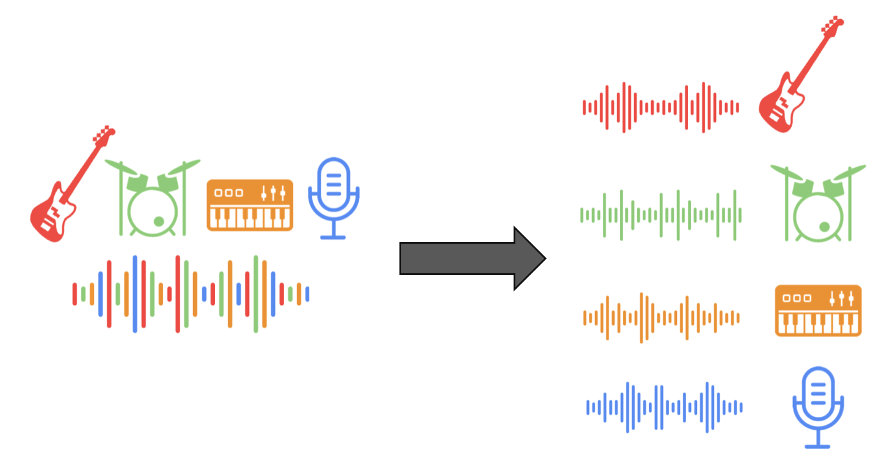

# Music-Separation-as-a-Service (MSaaS)



## Project Overview

In this project, I created a Kubernetes cluster to provide a REST API for automatic music separation. The system processes MP3 files by separating them into distinct tracks (e.g., vocals, bass, drums) and prepares these tracks for easy retrieval. I also designed a system to queue tasks and distribute work to multiple worker nodes using Redis. Additionally, I implemented an object storage service for storing and retrieving MP3 files and their separated output.

The core services in this project include:
- **REST API frontend**: Accepts API requests for analysis and handles queries concerning MP3 files.
- **Worker nodes**: Perform the heavy lifting of separating tracks from MP3 files and store the results in an object storage system.
- **Redis**: Used as a message queue to manage tasks between the REST API and worker nodes.

I followed the guidelines from the QwikLabs tutorials and the Kubernetes tutorial from CU's CSCI 4253/5253 course to guide me in building and deploying this system.

## Key Features

- **Music Separation**: Using the [Demucs](https://github.com/facebookresearch/demucs) open-source tool for waveform source separation, the system can separate various tracks (e.g., vocals, bass, drums) from a given MP3.
- **REST API**: A RESTful service that exposes an API to submit MP3 files for separation and query the status of tasks.
- **Redis Queue**: Redis manages the queuing of tasks. The REST frontend pushes tasks to the queue, while the worker nodes pull tasks to process and store results.
- **Object Storage**: MP3 files and their separated outputs are stored in a cloud object storage system (e.g., Min.io, S3). This avoids sending large files through Redis and improves performance.

## Architecture

### 1. REST Frontend
The REST API handles incoming requests, submits them to the Redis queue, and returns the status of tasks. 

- **Service**: The service listens for POST requests containing MP3 files and enqueues them in Redis.
- **Worker Communication**: The REST API communicates with Redis to manage work requests and track task completion.

### 2. Worker Nodes
Worker nodes pull tasks from the Redis queue, process MP3 files by separating their tracks, and store the results in an object store like Min.io or S3.

- **Worker Software**: The workers use the Demucs software for audio separation, which can be resource-intensive, so I recommend testing with small files during development.
- **Processing Time**: Audio separation can take up to 3-4 times the length of a song, depending on the system's resources.

### 3. Redis
Redis is used to manage tasks through its list data structures. The system uses `lpush` to push tasks into the queue and `blpop` to block and pop tasks for worker nodes.

### 4. Object Storage (Min.io)
The results of the audio separation process are stored in an object storage system, which allows easy retrieval and download.

- **Storage Buckets**: There are two main buckets:
  - **queue**: Holds incoming MP3 files for processing.
  - **output**: Stores the separated tracks from the processed MP3 files.
  
This enables efficient and scalable storage of large files without overloading the Redis database.


## Kubernetes Deployment

The project was deployed on Kubernetes, either locally or using Google Kubernetes Engine (GKE) for production. 

### Steps:
1. **Set up Kubernetes Cluster**: I created a Kubernetes cluster for local development, then deployed to GKE for production.
2. **Deploy Redis**: I deployed the Redis service to manage task queues.
3. **Deploy Min.io**: An object storage service was deployed using Min.io for storing MP3 files and separation outputs.
4. **Deploy REST API**: The frontend service was deployed to handle API requests and manage task queues.
5. **Deploy Worker Nodes**: Worker nodes were deployed to handle the actual separation of MP3 files.

### Port Forwarding for Local Development
During development, I used port forwarding to connect services running in the Kubernetes cluster (e.g., Redis, Min.io) to my local machine. This allowed the REST API and worker nodes to interact with the services locally.

Example:
```bash
kubectl port-forward --address 0.0.0.0 service/redis 6379:6379 &
kubectl port-forward --namespace minio-ns svc/myminio-proj 9000:9000 &
